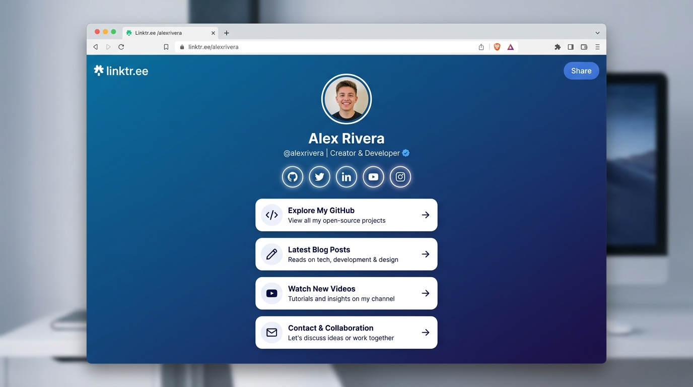
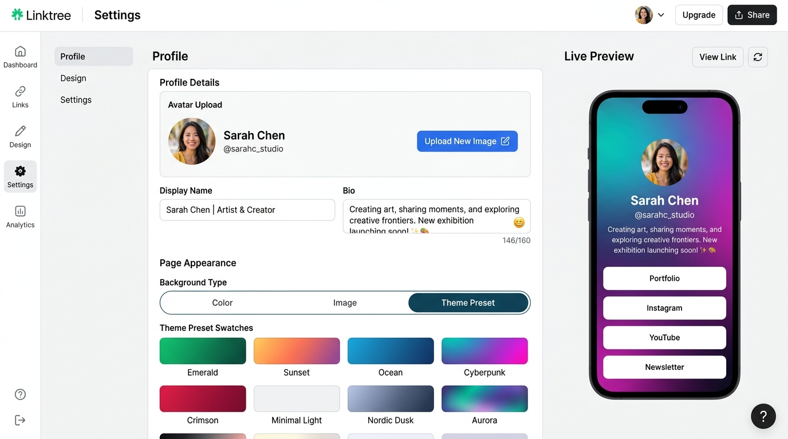
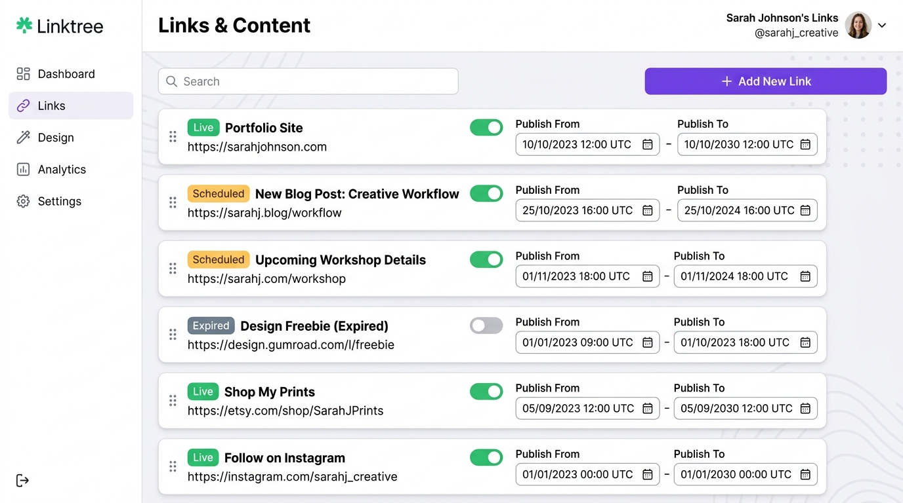
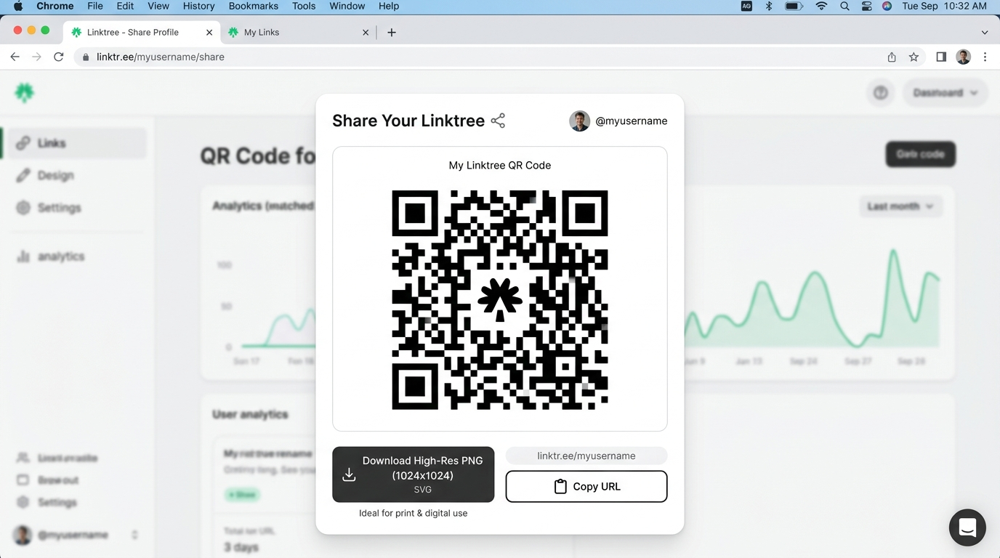
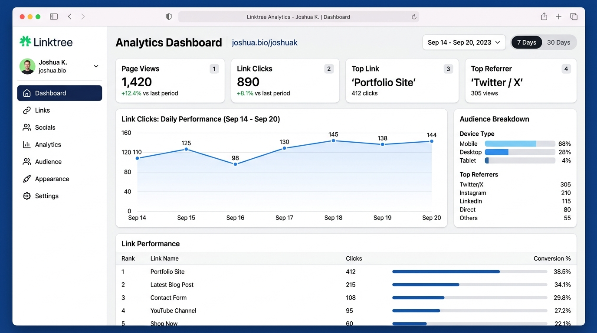

# Linktree — Modern Bio Link & Analytics Platform

[](https://nextjs.org/)
[](https://react.dev/)
[](https://www.mongodb.com/)
[](https://tailwindcss.com/)
[](https://aws.amazon.com/s3/)
[](https://linktree-princeji.vercel.app/)

A full-stack, production-grade Linktree clone built with **Next.js 15 App Router**, **React 19**, **MongoDB**, **Tailwind CSS**, and **AWS S3**. Enables creators to publish scheduled bio links, apply curated visual themes, distribute print-ready QR codes, and analyze traffic with privacy-preserving, server-authoritative analytics.

---

## 🌟 Key Features

- ⏱️ **Link Lifecycle Scheduling**: Schedule links with optional start and end datetime windows (in UTC). Real-time status badges (`Live`, `Scheduled`, `Expired`) update seamlessly with inactive-state overrides.
- 🎨 **Curated Theme Presets**: Choose from 8 visual themes (Emerald, Sunset, Ocean, Cyberpunk, Crimson, Minimal Light, etc.) or customize colors and background images with real-time live preview.
- 📱 **Print-Ready QR Code Sharing**: Generate high-contrast, quiet-zone compliant QR codes and export 1024x1024 high-res PNGs for physical and digital distribution.
- 📊 **Actionable Analytics**: Track traffic over 7-day and 30-day half-open UTC windows. Features continuous daily click trend charts, server-side device parsing (Mobile/Desktop/Tablet), referrer classification (Direct/Internal/Domains), and deterministic link rankings.
- ☁️ **AWS S3 Storage & Quota Management**: 25 MB per-user media upload quota with automated in-use reference detection to prevent orphaned asset accumulation.
- 🛡️ **Hardened Access Control & Security**: Admin allowlist gating, session eviction upon revocation, distributed in-memory rate limiting, and fail-closed public URL canonicalization.

---

## 📸 Visual Showcase

### Public Profile & Theme Presets


### Dashboard Settings & Live Preview


### Link Lifecycle & UTC Scheduling


### QR Code Generator & High-Res PNG Export


### Analytics Dashboard (7d / 30d Views)


---

## 🛠️ Technology Stack

| Layer | Technology | Details |
|---|---|---|
| **Framework** | Next.js 15.2 (App Router) | Server Components, Server Actions, Route Handlers |
| **Frontend** | React 19, Tailwind CSS | Responsive UI, FontAwesome 6, Date-fns, React Google Charts |
| **Database** | MongoDB & Mongoose | Connection pooling, subdocument schemas, indexed URIs |
| **Object Storage** | AWS S3 (SDK v3) | User media uploads, avatar & background image assets |
| **Authentication** | NextAuth.js | OAuth sessions, allowlist middleware & session eviction |

---

## 🚀 Getting Started

### Prerequisites

- **Node.js**: v18.18+ or v20+
- **MongoDB**: Local instance or MongoDB Atlas cluster URI
- **AWS S3**: Bucket with IAM access credentials (PutObject, DeleteObject, GetObject)

### Local Setup (from Monorepo Root)

1. **Navigate to the project directory**:
   ```bash
   cd projects/linktree
   ```

2. **Configure Environment Variables**:
   ```bash
   cp .env.example .env
   ```
   Open `.env` and fill in your connection details:
   ```env
   # Database
   MONGODB_URI=mongodb://localhost:27017/linktree

   # AWS S3 Storage
   BUCKET_NAME=your-s3-bucket-name
   S3_ACCESS_KEY=your-aws-access-key-id
   S3_SECRET_KEY=your-aws-secret-access-key

   # Canonical Site & Auth URLs
   NEXT_PUBLIC_URL=http://localhost:3000
   NEXTAUTH_URL=http://localhost:3000
   NEXTAUTH_SECRET=your-nextauth-secret-key

   # Admin Allowlist
   ADMIN_EMAIL=admin@example.com
   ```

3. **Install Dependencies**:
   ```bash
   npm install
   ```

4. **Run Development Server**:
   ```bash
   npm run dev
   ```
   Open [http://localhost:3000](http://localhost:3000) in your browser.

5. **Build for Production**:
   ```bash
   npm run build
   npm run start
   ```

---

## 🧪 Verification & Automated Test Suites

The codebase includes automated test suites covering all architectural layers and features:

```bash
# Run individual verification suites
node --env-file=.env scripts/verify-phase1.5.js  # Admin auth, S3 quota, upload management
node --env-file=.env scripts/verify-phase2.js    # Behavioral defect fixes & 404 guards
node --env-file=.env scripts/verify-phase3.js    # UTC link lifecycle & scheduling
node --env-file=.env scripts/verify-phase4.js    # Theme registry & canonical QR sharing
node --env-file=.env scripts/verify-phase5.js    # Device/referrer parsing & 7d/30d analytics
node --env-file=.env scripts/verify-phase6.js    # Final release-gate & v1 requirement trace

# Run production build validation
npm run build
```

---

## 📁 Project Structure

```
projects/linktree/
├── action/                  # Server Actions (PageAction.js, UploadAction.js)
├── app/                     # Next.js 15 App Router
│   ├── (app)/               # Authenticated dashboard routes
│   │   ├── account/         # Account overview & profile customization
│   │   │   ├── admin/       # Admin allowlist management
│   │   │   ├── analytics/   # 7d / 30d analytics dashboard
│   │   │   └── uploads/     # S3 media manager & quota tracker
│   ├── (page)/[uri]/        # Public bio profile dynamic route
│   ├── api/                 # API Route Handlers (auth, click, page, upload)
│   └── layout.js            # Root layout & session providers
├── components/              # Reusable React UI Components
│   ├── analytics/           # AnalyticsClient, metrics KPI cards, rankings
│   ├── formItem/            # Form controls (RadioTogglers, Input)
│   ├── forms/               # PageSettingForm, PageButtonsForm, UserNameForm
│   ├── layout/              # AppSidebar, SectionBox, Header
│   ├── media/               # ProfileAvatar, LinkIcon, SafeImage
│   └── sections/            # QRCodeCard component
├── docs/screenshots/        # High-resolution UI showcase images
├── lib/                     # Core business logic & utilities
│   ├── analyticsData.js     # Server-authoritative analytics aggregation
│   ├── analyticsParser.js   # Server-side device & referrer normalizer
│   ├── connectToDB.js       # MongoDB singleton connection pool
│   ├── linkLifecycle.js     # Deterministic UTC link lifecycle evaluator
│   ├── rateLimit.js         # Distributed in-memory sliding window limiter
│   ├── siteUrl.js           # Canonical public URL resolver
│   └── themes.js            # Curated theme preset tokens registry
├── models/                  # Mongoose Schema Definitions (Page, User, Event, Upload)
├── scripts/                 # Automated behavioral verification suites
├── .env.example             # Complete environment configuration template
└── README.md                # Canonical documentation
```

---

## 📄 License & Attribution

Built by [Prince Ji](https://github.com/princeji100) · [princeji.com](https://princeji.com) · [Live Demo](https://linktree-princeji.vercel.app/)
